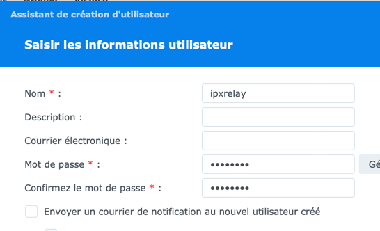
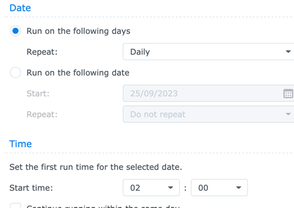

# homekitrelay

Homekit relay is a Homekit interface to GCE Elecronics IPX800V4.
It is insprired from homebridge but desinged to excusively work for IPX800.

The main benefit is being API friendly with the IPX.
HTTP Request are sent peacefully to avoid IPX internal resources issues.

Binding of HAP Services into IPX devices is made obvious and simple by the avoidance of generic drivers.

This projet includes a shell script to set up dependencies and start/stop in batch mode.

Homekit devices :
* GarageDoorOpener
* Lightbulb
* LightSensor
* Switch
* Outlet (to be tested)
* TemperatureSensor
* WindowCovering

The project is tested on a Synology, and is designed to run on tiny computer.

Requires at least python3.8. But python 3.9 is preferred.

## Installation
Download the installation package named : **package.tar**
Create a sub dir and extract the package :
```
mkdir homekitrelay
cd homekitrelay
tar xf ../package.tar
# install python packages.
./homekitrelay.sh setup
```

Then create the configuration file.
```
cd config
cp sample-config.json config.json
```
See below for the configuration settings.

As of version 3.5.1, HAP-python no longer supports python older than 3.6, because we
are moving to asyncio. If your platform does not have a compatible python out of the
box, you can install it manually or just use an older version of HAP-python.

## Synology installation
Create a user to host the package.

Apply defaut parameters.

Open the task scheduler.
### create a setup task
Planning
- Run on the following date
- choose today
- do not repeat.

Task setting 
- the command to launch is : /volume1/homes/ipxrelay/homekitrelay/homekitrelay.sh setup

Then run the task mannually.

### created a start/stop task.
Its purpose is to launch/restart the gateway at a specific hour.


Task settings is :
/volume1/homes/ipxrelay/homekitrelay/homekitrelay.sh restart

# configuration file

Configuration is based on a JSON file.

